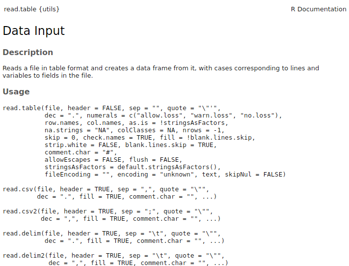

```{r setting functions and parameters, echo=FALSE, message=FALSE, warning=F}

# remove all objects
rm(list = ls())

# unload all non-based packages
out <- sapply(paste('package:', names(sessionInfo()$otherPkgs), sep = ""), function(x) try(detach(x, unload = FALSE, character.only = TRUE), silent = T))


options("digits"=5)
options("digits.secs"=3)
 


options(knitr.table.format = "html") 

x <- c("RColorBrewer", "ggplot2", "knitr", "kableExtra", "readxl", "tidyr", "dplyr")

aa <- lapply(x, function(y) {
  if(!y %in% installed.packages()[,"Package"])  {if(y != "warbleR") install.packages(y) else devtools::install_github("maRce10/warbleR")
}
try(require(y, character.only = T), silent = T)
  })


theme_set(theme_classic(base_size = 50))

cols <- brewer.pal(10,"Spectral")

```

### Before importing data

There are a few habits for data entry that will make it easier to import data correctly into `R`:

  - Reserve the first row for the header
  
  - Reserve the first column to the sampling unit
  
  - Use "_", "." or "-" instead of empty spaces (e.g. "Cornell_University")
  
  - Use short names
  
  - Avoid using uncommon symbols such as ?, $,%, ^, &, *, (, ),-,#, ?,,,<,>, /, |, \, [ ,] ,{, and }
  
  - Be consistent when referring to the same things (i.e. write them always in the same way)
  
  - Delete any extra comments outside the data set columns
  
  - Indicate missing values with NA (or at least empty spaces)
  
  - Don't even think about color-coding your data in excel

&nbsp;
 
### Importing data

Importing data into `R` is a crucial and apparently simple step. However, given the diversity of data formats and operating systems, as well as the many possible sources of error, inputting data in `R` is not always that straightforward. Most issues are related with:

  - Telling `R` in which directory the file is found
  
  - Telling `R` how the data is encoded (e.g. comma-separated, fixed width, etc)
  
  - Handling empty cells and uncommon characters

&nbsp;

### Setting the working directory

To read data in R you need to specify the working directory. It can be set with the function `setwd()`. The way you do this depends on the operating system (windows, mac, Linux). The folder directory syntax follows the nested structure of the folders. For instance:

```{r, eval=F, echo=T}

setwd("/home/m/Desktop/")

```

... sets the working directory in the folder "Desktop", which is found within "m", which is found within "home". 

&nbsp;

Some basic tips for setting the working directory:

  - Make sure the location is quoted

  - Make sure you have forward-slash (/) between folder names (although double backward-slashes seem to work in windows)

  - Do not include any file name in the folder directory name
  
  - To find the location you can look at the properties of a file in that folder and copy it

  - The path to the folder should be quoted ("")
 
  - The name matches exactly (better to copy/paste)
  
  - Use `list.files()` to check which files are in the working directory
  
   - `R` can suggest and auto-complete the folder names by pressing "tab" when within quotes:

 &nbsp; 
 


&nbsp;

<font size="5">Setting the working directory in windows</font> 

In windows it should be something like this:
```{r,eval=FALSE}

setwd("C:/location")

```

You can also do this (only on windows!):
```{r,eval=FALSE}

setwd(choose.dir())

```
&nbsp;
That should pop-up a window where you can choose the location. However, this should only be used to figure out the correct way to write the directory location, not as part of the script itself.


&nbsp;

<font size="5">Setting the working directory in OSX (mac)</font> 

For mac setting the working directory should be something like this:

```{r,eval=FALSE}

setwd("/Users/yourname/..")

```

do not include whatever you have before "users" (like macintosh... )

&nbsp;

<font size="5">Setting the working directory in Linux</font> 

Similar to the code used in OSX:
```{r, eval = F}

setwd("/home/m/Desktop/")

```
&nbsp;

The "~" (tilde) can also be used to skip the "home" and "user" folder in Linux:
```{r, eval = F}

setwd("~/Desktop/")

```
&nbsp;

The current working directory can be checked as follows:
```{r, eval = T}

getwd()

```
&nbsp;

### Reading data

Any file can be read in `R`. It's just a matter of letting `R` know in which format is the file encoded (e.g. what conventions were followed when generating the file). The most common formats to store/exchange data sets as the ones we usually handle in biological sciences are  *txt*, *csv* and *xls/xlsx*.

&nbsp;

The most commonly used function to import data in `R` is `read.table`. The documentation of this function actually includes all the default functions for inputting data:

```{r}
?read.table
```
&nbsp;



&nbsp;

<font size="5">Reading <i>.txt</i> files</font> 

*.txt* files can be read using `read.table`. Let's first download a freely available data set in *.txt* format:

```{r, eval = F, echo= T}

# set working directory
setwd("PUT THE FOLDER LOCATION WHERE YOU WANT TO SAVE THE FILE HERE")

download.file("http://esapubs.org/archive/ecol/E090/184/PanTHERIA_1-0_WR93_Aug2008.txt", destfile = "pantheria_mammals_data.txt")

```
You can also manually download the file from [here](http://esapubs.org/archive/ecol/E090/184/PanTHERIA_1-0_WR93_Aug2008.txt)

&nbsp;

The file can be input into `R` as follows:

```{r, eval = F, echo= T}

# read file
pntr_dt <- read.table("pantheria_mammals_data.txt", stringsAsFactors = FALSE, sep = "\t", header = TRUE)

# check data types for each column
sapply(pntr_dt[, 1:10], class)
```


```{r, eval = T, echo= F}

# read file
pntr_dt <- read.table("pantheria_mammals_data.txt", stringsAsFactors = FALSE, sep = "\t", header = TRUE)


```

```{r, eval = F, echo= T}

# check structure
head(pntr_dt)

```

```{r, eval = T, echo= F}

# check structure
knitr::kable(pntr_dt[1:6, 1:6], row.names = F, escape = FALSE) %>%
  kable_styling(bootstrap_options = c("striped", "hover", "condensed", "responsive"), full_width = FALSE, font_size = 14)

knitr::kable(pntr_dt[1:6, 7:10], row.names = F, escape = FALSE) %>%
  kable_styling(bootstrap_options = c("striped", "hover", "condensed", "responsive"), full_width = FALSE, font_size = 14)

```
&nbsp;

The file name is quoted and contains the file extension.

&nbsp;

Note that the value -999 is used to define empty cells. We can read this values as *NAs* while importing the data using the 'na.strings' argument:

```{r, eval = F, echo= T}

# read file
pntr_dt <- read.table("pantheria_mammals_data.txt", sep = "\t", header = TRUE, na.strings = "-999")

# check structure
head(pntr_dt)

```

```{r, eval = T, echo= F}

# read file
pntr_dt <- read.table("pantheria_mammals_data.txt", stringsAsFactors = FALSE, sep = "\t", header = TRUE, na.strings = "-999")


# check structure
knitr::kable(pntr_dt[1:6, 1:6], row.names = F, escape = FALSE) %>%
  kable_styling(bootstrap_options = c("striped", "hover", "condensed", "responsive"), full_width = FALSE, font_size = 14)

knitr::kable(pntr_dt[1:6, 7:10], row.names = F, escape = FALSE) %>%
  kable_styling(bootstrap_options = c("striped", "hover", "condensed", "responsive"), full_width = FALSE, font_size = 14)

```
&nbsp;

<font size="5">Reading <i>.csv</i> files</font> 

Again, we can download an example file online:

```{r, eval = F, echo= T}

download.file("http://www.birds.cornell.edu/clementschecklist/wp-content/uploads/2013/03/eBird_Taxonomy_v2017_18Aug2017.csv", destfile = "clements_bird_list.csv")

clm_lst <- read.csv("clements_bird_list.csv", stringsAsFactors = FALSE)

head(clm_lst)

```


```{r, eval = T, echo= F}

clm_lst <- read.csv("clements_bird_list.csv", stringsAsFactors = FALSE)

# check structure
knitr::kable(clm_lst[1:6, 1:5], row.names = F, escape = FALSE) %>%
  kable_styling(bootstrap_options = c("striped", "hover", "condensed", "responsive"), full_width = FALSE, font_size = 14)

knitr::kable(clm_lst[1:6, 6:9], row.names = F, escape = FALSE) %>%
  kable_styling(bootstrap_options = c("striped", "hover", "condensed", "responsive"), full_width = FALSE, font_size = 14)

```

You can also manually download the file from [here](http://www.birds.cornell.edu/clementschecklist/wp-content/uploads/2013/03/eBird_Taxonomy_v2017_18Aug2017.csv)

&nbsp;


As in the previous example, we can tell `R` how to identify empty cells using the 'na.strings' argument:

```{r, eval = F, echo= T}

download.file("http://www.birds.cornell.edu/clementschecklist/wp-content/uploads/2013/03/eBird_Taxonomy_v2017_18Aug2017.csv", destfile = "clements_bird_list.csv")

clm_lst <- read.csv("clements_bird_list.csv", stringsAsFactors = FALSE)

head(clm_lst)

```


```{r, eval = T, echo= F}

clm_lst <- read.csv("clements_bird_list.csv", stringsAsFactors = FALSE, na.strings = "")

# check structure
knitr::kable(clm_lst[1:6, 1:5], row.names = F, escape = FALSE) %>%
  kable_styling(bootstrap_options = c("striped", "hover", "condensed", "responsive"), full_width = FALSE, font_size = 14)

knitr::kable(clm_lst[1:6, 6:9], row.names = F, escape = FALSE) %>%
  kable_styling(bootstrap_options = c("striped", "hover", "condensed", "responsive"), full_width = FALSE, font_size = 14)

```
&nbsp;

### Reading excel files

Most researchers enter data into excel spreadsheets. So it would be pretty handy to read the data directly from there. To read *xls* and *xlsx* files we need to install the package "readxl" (there are other packages that can be used but they all work similarly):

```{r,eval=FALSE}

install.packages(pkgs = "readxl")

```
&nbsp;

And load it: 

```{r, eval=F}

library(readxl)

```
&nbsp;

As we did above, download an example file from an online repository. In this case is the same Clements bird taxonomy list in *xlsx* format:

```{r, eval = F, echo= T}

download.file("http://www.birds.cornell.edu/clementschecklist/wp-content/uploads/2017/08/eBird_Taxonomy_v2017_18Aug2017.xlsx", destfile = "clements_bird_list.xlsx")

```
You can also manually download the file from [here](http://www.birds.cornell.edu/clementschecklist/wp-content/uploads/2017/08/eBird_Taxonomy_v2017_18Aug2017.xlsx)

&nbsp;

Now we can use the function `read_excel()` to read the file: 

```{r, eval = F, echo= T}

# read file
clm_lst2 <- read_excel("clements_bird_list.xlsx", sheet = 1)

head(clm_lst2)
```

```{r, eval = T, echo= F}

clm_lst2 <- read_excel("clements_bird_list.xlsx", sheet = 1)

# check structure
knitr::kable(clm_lst2[1:6, 1:5], row.names = F, escape = FALSE) %>%
  kable_styling(bootstrap_options = c("striped", "hover", "condensed", "responsive"), full_width = FALSE, font_size = 14)

knitr::kable(clm_lst2[1:6, 6:9], row.names = F, escape = FALSE) %>%
  kable_styling(bootstrap_options = c("striped", "hover", "condensed", "responsive"), full_width = FALSE, font_size = 14)

```
&nbsp;

You need to specify the file name (including extension) and the excel sheet (tab) name. `read_excel()` auto detects the format from the file extension. The functions `read_xls()` and `read_xlsx()` can be used to read files without extension.

&nbsp;


<div class="alert alert-info">

<font size="5">Exercise 1</font> 

All default functions to input data into `R` have a counterpart to export the same type of data. The names of these other functions are similar to the ones for reading data, although they typically start with "write" or "save".

</br>

1.1 What are the names of the default functions for exporting the data formats we used above? (hint: try `apropos` to check which functions are available) 

</br>

1.2 Export the mammals data as a *.csv* file 

</br>

1.3 Export the mammals data again, this time excluding the row names

</br>

1.4 Read the *.csv* file using `read.table`

</br>

1.5 What other packages can import excel files into `R`?

</br>

1.6 Can you export an excel file or add data to an existing excel file from `R`? 

</br> 

1.7 Using the "clements_bird_list.csv" file, how would you tell `R` to read both "Rheiformes" and "Ostriches" as empty cells (while still reading empty cells as empty cells)? 

</div>


```{r, eval = F, echo= F}

# 1.4
clm_lst3 <- read.table("clements_bird_list.csv", stringsAsFactors = FALSE, header = TRUE, sep = ",", fill = T)

# 1.7
clm_lst <- read.csv("clements_bird_list.csv", stringsAsFactors = FALSE, na.strings = c("",  "Rheiformes", "Ostriches"))

# check structure
knitr::kable(clm_lst[1:6, 1:5], row.names = F, escape = FALSE) %>%
  kable_styling(bootstrap_options = c("striped", "hover", "condensed", "responsive"), full_width = FALSE, font_size = 14)

knitr::kable(clm_lst[1:6, 6:9], row.names = F, escape = FALSE) %>%
  kable_styling(bootstrap_options = c("striped", "hover", "condensed", "responsive"), full_width = FALSE, font_size = 14)

```
---

### Formatting data

This section deals with organizing your data in a way that simplify its handling, exploration and analysis. As you can probably guess, the more consistent things are done, the more predictable they become. This also applies to data. If data is organized with the same logic, you can expect the same type of manipulations and analyses to be applicable on different data sets. Organizing the data is a key  (but usually neglected) aspect of the data analysis workflow. When data is properly organized you will spend much less time on formatting and more time on the actual analytic questions.

When possible, we will run the data formatting examples using both the 'tidyr' package and the base `R` functions.

### Tidy data

"Tidy data" is a logic for organizing data sets in a consistent and intuitive way. To run some of the code below you will need the 'tidyr' and 'dplyr' packages, which can be installed/loaded as follows: 

```{r,eval=FALSE}

install.packages(pkgs = "tidyr")

install.packages(pkgs = "dplyr")

library(tidyr)

library(dplyr)

```
&nbsp;

The same data can be represented in many ways. In the example below each data set shows exactly the same values of four variables *country*, *year*, *population*, and *cases*, but in each data set values are organized in a different way. The data shows the number of tuberculosis cases in Afghanistan, Brazil, and China between 1999 and 2000:

```{r, eval=F, echo=T}

as.data.frame(table1)

```

```{r, eval=T, echo=F}

# check structure
knitr::kable(table1, row.names = F, escape = FALSE) %>%
  kable_styling(bootstrap_options = c("striped", "hover", "condensed", "responsive"), full_width = FALSE, font_size = 14)

```


```{r, eval=F, echo=T}

as.data.frame(table2)

```

```{r, eval=T, echo=F}

# check structure
knitr::kable(table2, row.names = F, escape = FALSE) %>%
  kable_styling(bootstrap_options = c("striped", "hover", "condensed", "responsive"), full_width = FALSE, font_size = 14)

```

```{r, eval=F, echo=T}

as.data.frame(table3)

```

```{r, eval=T, echo=F}


# check structure
knitr::kable(table3, row.names = F, escape = FALSE) %>%
  kable_styling(bootstrap_options = c("striped", "hover", "condensed", "responsive"), full_width = FALSE, font_size = 14)

```

Or even spread across 2 different data sets:

```{r, eval=F, echo=T}

as.data.frame(table4a)

```

```{r, eval=T, echo=F}

# check structure
knitr::kable(table4a, row.names = F, escape = FALSE) %>%
  kable_styling(bootstrap_options = c("striped", "hover", "condensed", "responsive"), full_width = FALSE, font_size = 14)

```


```{r, eval=F, echo=T}

as.data.frame(table4b)

```

```{r, eval=T, echo=F}

# check structure
knitr::kable(table4b, row.names = F, escape = FALSE) %>%
  kable_styling(bootstrap_options = c("striped", "hover", "condensed", "responsive"), full_width = FALSE, font_size = 14)

```
&nbsp;

All these data sets contained the same underlying data. However, they are not equally easy to use.

There are three interrelated rules to make a data set tidy:

1. Each variable must have its own column

1. Each observation must have its own row

1. Each value must have its own cell

This figure shows the rules visually:


<font size="2">* Modified from <i>R for Data Science</i></font>
&nbsp;

These three rules are interrelated because it's impossible to only satisfy two of the three. That interrelationship leads to an even simpler set of practical instructions:

1.  Put each data set in a data frame

1.  Put each variable in a column

&nbsp;

In the example above, only `table1` is tidy. It's the only representation where each column is a variable. There are two main advantages of formatting the data in this way:

1. If you have a consistent data structure, it's easier to learn the tools that work with it because they have an underlying uniformity
    
1. Placing variables in columns fits well `R`'s vectorized nature. As we have seen, built-in `R` functions work with vectors of values. That makes transforming tidy data feel particularly natural

&nbsp;

<div class="alert alert-info">

<font size="5">Exercise 2</font> 

</br>

2.1 Describe how the variables and observations are organized in each of the sample data frames

</br>

2.2 Calculate the rate of cases per 10000 people for "table1", "table2" and "table4a"/"table4b" 

</div>

---

### Gathering data

A common problem is a data set where some of the column names are not names of variables, but values of a variable. Take "table4a": the column names 1999 and 2000 represent values of the year variable, and each row represents two observations, not one:

```{r, eval=F, echo=T}

as.data.frame(table4a)

```

```{r, eval=T, echo=F}

# check structure
knitr::kable(table4a, row.names = F, escape = FALSE) %>%
  kable_styling(bootstrap_options = c("striped", "hover", "condensed", "responsive"), full_width = FALSE, font_size = 14)

```
&nbsp;

To tidy a data set like this, we need to __gather__ those columns into a new pair of variables. To do this we need three parameters:

* The set of columns that represent values, not variables. In this example, 
  those are the columns `1999` and `2000`

* The name of the variable whose values form the column names. In the 'tidyr' syntax that is called  the `key`, which in this case is `year`

* The name of the variable whose values are spread over the cells. In the 'tidyr' syntax that is called that `value`, which in this case is the number of `cases`
  
  
These parameters can be used to create a tidy data set using the function `gather()`:

```{r, eval=F, echo=T}

gather(table4a, key = "year", value = "cases", `1999`, `2000`)

```

```{r, eval=T, echo=F}

g1 <- gather(table4a, key = "year", value = "cases", `1999`, `2000`)

# check structure
knitr::kable(g1, row.names = F, escape = FALSE) %>%
  kable_styling(bootstrap_options = c("striped", "hover", "condensed", "responsive"), full_width = FALSE, font_size = 14)

```

We can visualize this formatting as follows:


<font size="2">* Modified from <i>R for Data Science</i></font>
&nbsp;

 `gather()` can also be used to tidy `table4b`. The only difference is the variable stored in the cell values:

```{r, eval=F, echo=T}

gather(data = table4b, key = "year", value = "population", `1999`, `2000`)

```

```{r, eval=T, echo=F}
g2 <- gather(data = table4b, key = "year", value = "population",`1999`, `2000`)

# check structure
knitr::kable(g2, row.names = F, escape = FALSE) %>%
  kable_styling(bootstrap_options = c("striped", "hover", "condensed", "responsive"), full_width = FALSE, font_size = 14)
```
&nbsp;

To combine the tidied versions of `table4a` and `table4b` into a single data frame (or 'tibble'), we can either  use `dplyr::left_join()` or `merge()` from base `R`:

```{r, eval=F, echo=T}

tidy4a <- gather(table4a, key = "year", value = "cases", `1999`, `2000`)

tidy4b <- gather(table4b, key = "year", value = "population", `1999`, `2000`)

left_join(x = tidy4a, y = tidy4b, by = c("country", "year"))

```

```{r, eval=T, echo=F}

tidy4a <- gather(table4a, `1999`, `2000`, key = "year", value = "cases")

tidy4b <- gather(table4b,`1999`, `2000`, key = "year", value = "population")

g3 <- left_join(x = tidy4a, y = tidy4b, by = c("country", "year"))

# check structure
knitr::kable(g3, row.names = F, escape = FALSE) %>%
  kable_styling(bootstrap_options = c("striped", "hover", "condensed", "responsive"), full_width = FALSE, font_size = 14)
```
&nbsp;

```{r, eval=F, echo=T}

merge(x = tidy4a, y =  tidy4b, by = c("country", "year"))

```

```{r, eval=T, echo=F}

g4 <- merge(tidy4a, tidy4b)

# check structure
knitr::kable(g4, row.names = F, escape = FALSE) %>%
  kable_styling(bootstrap_options = c("striped", "hover", "condensed", "responsive"), full_width = FALSE, font_size = 14)
```
&nbsp;


### Spreading

Spreading is the opposite of gathering. You use it when an observation is scattered across multiple rows. For example, in `table2` an observation is a country in a year, but each observation is spread across two rows:

```{r, eval=F, echo=T}

table2

```

```{r, eval=T, echo=F}

# check structure
knitr::kable(table2, row.names = F, escape = FALSE) %>%
  kable_styling(bootstrap_options = c("striped", "hover", "condensed", "responsive"), full_width = FALSE, font_size = 14)

```
&nbsp;


To tidy this data set up, we only need two parameters:

* The column that contains variable names, the `key` column. Here, it's 
  `type`.

* The column that contains values forms multiple variables, the `value`
  column. Here it's `count`.

&nbsp;

To do this we can use `spread()`:

```{r, eval=F, echo=T}

spread(table2, key = "type", value = "count")

```

```{r, eval=T, echo=F}

sp1 <- spread(table2, key = "type", value = "count")

# check structure
knitr::kable(sp1, row.names = F, escape = FALSE) %>%
  kable_styling(bootstrap_options = c("striped", "hover", "condensed", "responsive"), full_width = FALSE, font_size = 14)

```
&nbsp;

which can be visualized as follows:


<font size="2">* Modified from <i>R for Data Science</i></font>
&nbsp;

`spread()` and `gather()` are complementary functions. `gather()` makes wide tables narrower and longer; `spread()` makes long tables shorter and wider.

&nbsp;

<div class="alert alert-info">

<font size="5">Exercise 3</font> 

</br>

3.1 Tidy up the following data set on tree height for 2 species:

```{r}

plnt_sz <- data.frame(forest = c("old_growth", "disturbed"), 
                      Species_1 = c(154, 160), 
                      Species_2 = c(120, 113))

```

</div>

&nbsp;

---

<font size="5">Separating and uniting</font>  

So far we have fixed "table2" and "table4", but not "table3". "table3" has a different problem: we have one column (*rate*) that contains two variables (*cases and *population*). This can be fixed using the `separate()` function . We will also look at its complement`unite()`, which is used when a single variable is spread across multiple columns.

&nbsp;

### Separate

`separate()` pulls apart one column into multiple columns, by splitting wherever a separator character appears. Take `table3`:

```{r, eval=F, echo=T}

as.data.frame(table3)

```

```{r, eval=T, echo=F}

# check structure
knitr::kable(table3, row.names = F, escape = FALSE) %>%
  kable_styling(bootstrap_options = c("striped", "hover", "condensed", "responsive"), full_width = FALSE, font_size = 14)

```

Visually it does something like this:


<font size="2">* Modified from <i>R for Data Science</i></font>

&nbsp;

The *rate* column contains both *cases* and *population* variables, and we need to split it into two variables. `separate()` takes the name of the column to separate, and the names of the new columns to be created: 

```{r, eval=F, echo=T} 

separate(data = table3, col =  rate, into = c("cases", "population"))

```

```{r, eval=T, echo=F}

g5 <- separate(data = table3, col =  rate, into = c("cases", "population"))

knitr::kable(g5, row.names = F, escape = FALSE) %>%
  kable_styling(bootstrap_options = c("striped", "hover", "condensed", "responsive"), full_width = FALSE, font_size = 14)

```

By default, `separate()` will split based on any non-alphanumeric character (i.e. a character that isn't a number or letter). In the code above, `separate()` split the values of *rate* at the forward slash characters. This can be explicitly stated (to avoid any errors):

```{r eval = FALSE}

tb3 <- separate(data = table3, col = rate,  into = c("cases", "population"), sep = "/")

tb3 

```

```{r, eval=T, echo=F}

g6 <- separate(data = table3, col = rate,  into = c("cases", "population"), sep = "/")

knitr::kable(g6, row.names = F, escape = FALSE) %>%
  kable_styling(bootstrap_options = c("striped", "hover", "condensed", "responsive"), full_width = FALSE, font_size = 14)

str(g6)
```
&nbsp;

Note that the *case* and *population* are character columns. By default `separate()` leaves the type of the new columns as in the original one. In this case this is not ideal as those really are numbers. We can ask `separate()` to try and convert to better types using `convert = TRUE`:

```{r, eval=T, echo=T}

tb3 <- separate(data = table3, col = rate, into = c("cases", "population"), convert = TRUE)

str(tb3)
```
&nbsp;

You can also pass a vector of integers to `sep`, which will be interpreted as positions to split at. Positive values start at 1 on the far-left of the strings; negative value start at -1 on the far-right of the strings. When using integers to separate strings, the length of `sep` should be one less than the number of names in `into`. 
You can use this to separate the last two digits of each year:

```{r, eval=F}

separate(data = table3, col = year, into = c("century", "year"), 
         sep = 2)

```

```{r, eval=T, echo=F}

g8 <- separate(data = table3, col = year, into = c("century", "year"), sep = 2)

knitr::kable(g8, row.names = F, escape = FALSE) %>%
  kable_styling(bootstrap_options = c("striped", "hover", "condensed", "responsive"), full_width = FALSE, font_size = 14)

```

Separating columns can also be done with base `R`, although it takes a bit more coding:

```{r eval = FALSE}

table3$cases <- sapply(table3$rate, function(x) try(strsplit(x, "/")[[1]][1]), USE.NAMES = FALSE)

table3$population <- sapply(table3$rate, function(x) try(strsplit(x, "/")[[1]][2]), USE.NAMES = FALSE)

tb3 

```

```{r, eval=T, echo=F}

table3$cases <- sapply(table3$rate, function(x) try(strsplit(x, "/")[[1]][1]), USE.NAMES = FALSE)

table3$population <- sapply(table3$rate, function(x) try(strsplit(x, "/")[[1]][2]), USE.NAMES = FALSE)

knitr::kable(table3, row.names = F, escape = FALSE) %>%
  kable_styling(bootstrap_options = c("striped", "hover", "condensed", "responsive"), full_width = FALSE, font_size = 14)

str(g6)
```
&nbsp;

### Unite

`unite()` is the inverse of `separate()`: combining multiple columns into a single column:


<font size="2">* Modified from <i>R for Data Science</i></font>

&nbsp;

However, you will need it much less frequently than `separate()`. 

We can use `unite()` to rejoin the *century* and *year* columns that we created above:

```{r, eval=F}
unite(data = table5, col = "new", "century", "year")
```

```{r, eval=T, echo=F}

g9 <- unite(data = table5, col = "new", "century", "year")

knitr::kable(g9, row.names = F, escape = FALSE) %>%
  kable_styling(bootstrap_options = c("striped", "hover", "condensed", "responsive"), full_width = FALSE, font_size = 14)

```

In this function we can also use the `sep` argument (although in this example it was not specified).


&nbsp;

<div class="alert alert-info">

<font size="5">Exercise 3</font> 

</br>

3.1 Unite *century* and *year* in "table5" using base `R` (hint: `paste()`)

</br>

</div>

----


### References

  - Clements, J. F., T. S. Schulenberg, M. J. Iliff, D. Roberson, T. A. Fredericks, B. L. Sullivan, and C. L. Wood. 2017. *The eBird/Clements checklist of birds of the world: v2016*.
  
  - Jones, Jon Bielby, Marcel Cardillo, Susanne A. Fritz, Justin O'Dell, C. David L. Orme, Kamran Safi, Wes Sechrest, Elizabeth H. Boakes, Chris Carbone, Christina Connolly, Michael J. Cutts, Janine K. Foster, Richard Grenyer, Michael Habib, Christopher A. Plaster, Samantha A. Price, Elizabeth A. Rigby, Janna Rist, Amber Teacher, Olaf R. P. Bininda-Emonds, John L. Gittleman, Georgina M. Mace, and Andy Purvis. 2009. *PanTHERIA: a species-level database of life history, ecology, and geography of extant and recently extinct mammals*. Ecology 90:2648.
  
  - Wickham, Hadley, and Garrett Grolemund. 2016. *R for data science: import, tidy, transform, visualize, and model data*.  [website](http://r4ds.had.co.nz)
  
  - [Data import tutorial- DataCamp](https://www.datacamp.com/community/tutorials/r-data-import-tutorial)
  
---

<font size="4">Session information</font>

```{r session info, echo=F}

sessionInfo()

```