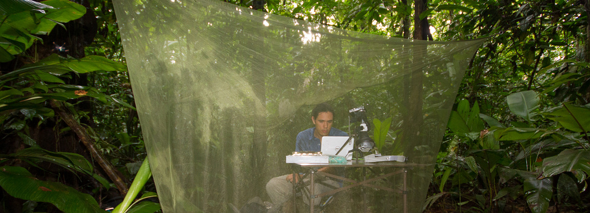

```{css, echo=FALSE}
h1, h4 {
  text-align: center;
}
```

<center></center>

&nbsp; 

<font size="4">

I'm just another behavioral ecologists that ended up doing a lot of coding just to get data analysis done. My research aims to understand how behavior has evolved and which factors have influenced it, spanning both cultural and evolutionary timescales. I'm deeply involved in the development of computational tools for (non-genetic) biological data analyses, mostly related to animal behavior and bioacoustics. I'm the developer and maintainer of the R packages [warbleR](https://marce10.github.io/warbleR/index.html), [Rraven](https://marce10.github.io/Rraven/index.html), [ohun](https://marce10.github.io/ohun/index.html) and [baRulho](https://marce10.github.io/baRulho/index.html) that provide functions to streamline high-throughput acoustic analysis of animal sounds, aiming to simplify the use of R for bioacoustic research. More recently I released the R packages [PhenotypeSpace](https://marce10.github.io/PhenotypeSpace/index.html) for quantifying multidimensional trait spaces, [dynaSpec](https://marce10.github.io/dynaSpec/index.html) for creating dynamic spectrograms, [sketchy](https://marce10.github.io/sketchy/index.html) for organizing research compendiums and [brmsish](https://marce10.github.io/brmsish/index.html) for customizing the output of bayesian regression models. 
